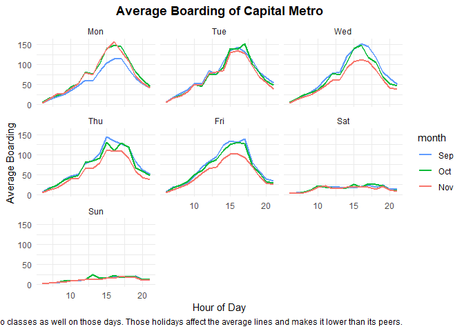
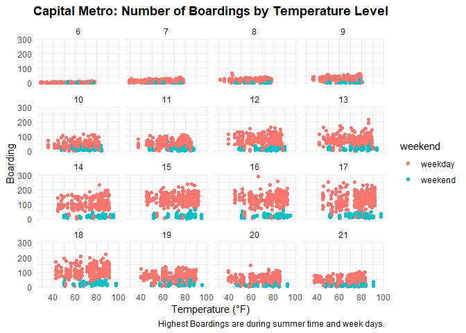
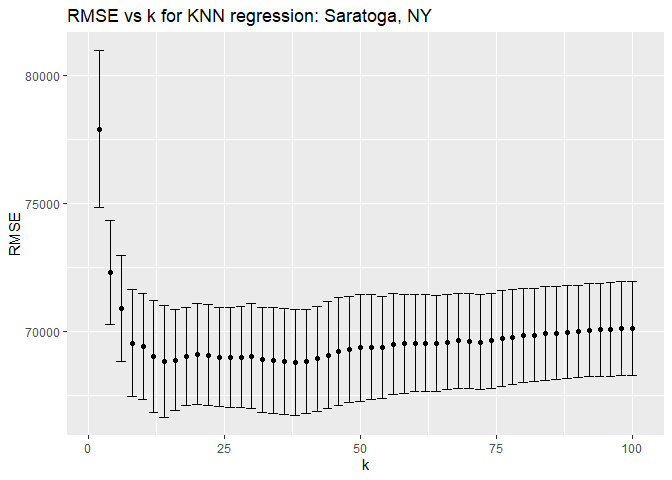
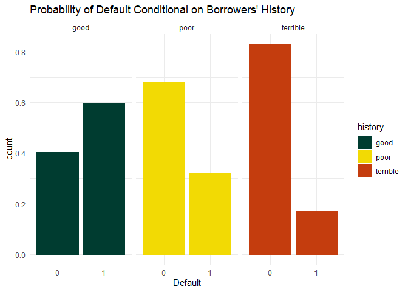
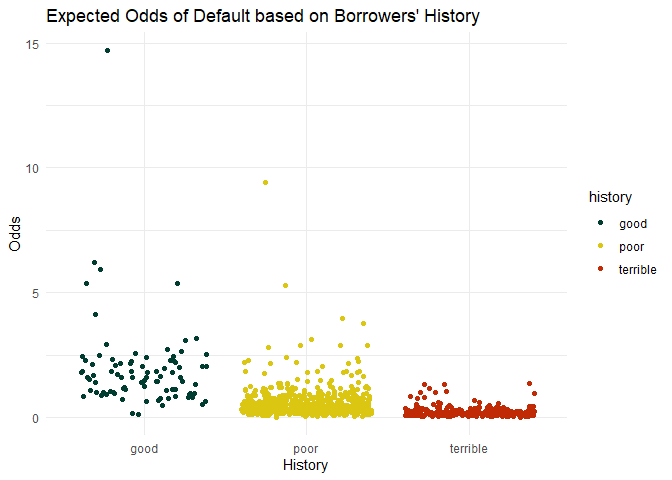

# **Problem 1: visualization**

\#**Problem 2: Saratoga house prices**

## *Model 1*

RMSE is 73443.63

\#\#*Model 2*

    ## [1] 63553.81

Minimum error from the list is 61744.19 better than previous model.

# **Problem 3: Classification and retrospective sampling**

    ##        history
    ## Default good poor terrible
    ##       0   36  421      243
    ##       1   53  197       50

    ##         (Intercept)            duration              amount         installment 
    ##               -0.71                0.03                0.00                0.22 
    ##                 age         historypoor     historyterrible          purposeedu 
    ##               -0.02               -1.11               -1.88                0.72 
    ## purposegoods/repair       purposenewcar      purposeusedcar       foreigngerman 
    ##                0.10                0.85               -0.80               -1.26

    ## data frame with 0 columns and 0 rows

# **Problem 4: Children and hotel reservations**

## *Model building*

-   model baseline 1

The Out-Of-Sample RMSE we got for this model is 3.1.

-   model baseline 2

The Out-Of-Sample RMSE for the second model is 4.0. Higher than model 1,
this shows that the arrival\_date variable is an important one for the
model. We could use it in our feature engineering for the following
model.

-   model baseline 3

We will add the arrival date variable to indicate seasonality as the
feature engineering for this model. A new two columns will be added as
date and month for R to read from and for us to use in the model.

RMSE for this model 3.17 I couldn’t improve it more than model
baseline1.

## *Model Validation: step 1*

RMSE here is 3.15 based on the new dataset hotels\_val.

## *Model Validation: step 2*

Couldn’t Run the below code:

hotel\_dev\_split = initial\_split(hotels\_dev, prop = 0.8)
hotel\_dev\_train = training(hotel\_dev\_split) hotel\_dev\_test =
testing(hotel\_dev\_split)

childX &lt;- model.matrix(children ~ (.-arrival\_date)^2 -1, data =
hotel\_dev\_train) childY &lt;- hotel\_dev\_train$children

childLasso &lt;- cv.glmnet(x = childX, y = childY, alpha = 1, family =
“binomial”, nfold = 20, trace.it = 1, standardize = FALSE)

testMatrix = model.matrix(children ~ (.-arrival\_date)^2 -1, data =
hotel\_dev\_test)

hotel\_dev\_test = mutate(.data = hotel\_dev\_test, childPred3 =
predict(childLasso, newx = Xtest, type = “class”, s = ‘lambda.min’))

Confused\_best\_child = table(y =
hotel\_dev\_test*c**h**i**l**d**r**e**n*, *y**h**a**t**L**a**s**s**o* = *h**o**t**e**l**d**e**v**t**e**s**t*childPred3)

Confused\_best\_child
