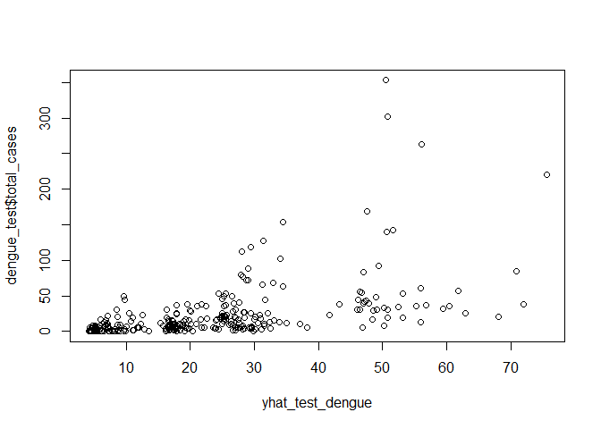
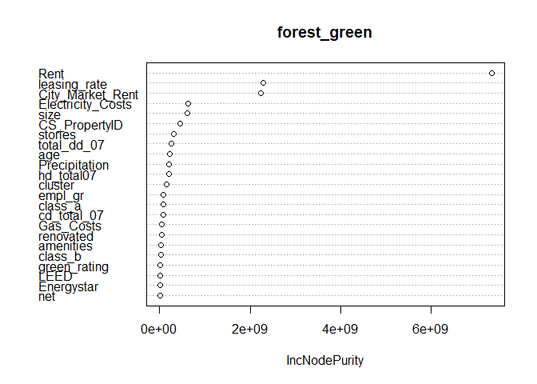

## What causes what?

**(1) Why can’t I just get data from a few different cities and run the
regression of “Crime” on “Police” to understand how more cops in the
streets affect crime? (“Crime” refers to some measure of crime rate and
“Police” measures the number of cops in a city.)**

Because of the endogeneity issue, which means a correlation exists
between the police variable and the error term in the regression (Crime
on Police). In other words, when a city already has high crime rates,
the number of cops tends to be high already. Therefore, fitting a
regression with an endogeneity issue will give biased results. Solutions
to endogeneity vary based on the situation, but some of them could be:

1- Find and include omitted variables. 2- Find and include a proxy
variable in the model. 3- Using a fixed effect estimator with panel data
eliminates individual-specific effects. 4- Use Instrument Variable (IV)
to replace the endogenous variable with a predicted value that has only
exogenous shocks.

**2- How were the researchers from UPenn able to isolate this effect?
Briefly describe their approach and discuss their result in the “Table
2” below, from the researchers’ paper.**

The researchers have used the “Terror Alert” variable to replace the
effect of raising the number of cops since it is an exogenous variable
in the crime model, which could solve the endogeneity issue. However,
they have also assumed that “Terror Alert” might not be a good proxy
since the number of tourists might decrease when there is a high Terror
Alert. To consider that, they have isolated the effect of metro
ridership by including log(midday ridership) as a variable in the
regression. So, the first column is the uncontrolled effect which says
that when Terror Alert elevates (cops on the street increases), the
daily crime rate is expected to decrease by 7.32. However, when they
control the metro ridership, they still expect a decline in the number
of crimes by 6.1. As a result, raising the number of cops would decrease
the number of crimes in DC.

**3- Why did they have to control for Metro ridership? What was that
trying to capture?**

They assumed that crime might decrease if the number of tourists
declined during high alert days. So, their results might be biased.
Their methodology uses the “Terror Alert” variable as a proxy to
“Police” since they have a high correlation. At the same time, they used
Metro ridership as a proxy for tourism in DC. They did that because they
assumed that crimes and tourists have a high correlation, and by having
higher terror alerts, the number of crimes might decrease because fewer
tourists would visit DC. So, by adding Metro ridership in the regression
model, they were able to control for the effect of tourism and to have
the isolated impact of Terror Alert, which is a proxy of “Police”. In
other words, after controlling for metro ridership, the number of daily
crimes in DC is expected to decrease by 6.1 when the Terror Alert
elevates.

**4- Below I am showing you “Table 4” from the researchers’ paper. Just
focus on the first column of the table. Can you describe the model being
estimated here? What is the conclusion?**

In this table, the researchers included the district fixed effects in
the regression by using the district variable as an interaction variable
with “High Alert” to control the different patterns of crimes between
districts when “Terror Alert” elevates. They assumed that most of the
cops would be in District 1 since The White House is there. So, when
there is an order to the police to prioritize district 1, that might
affect the other districts. So, they controlled for this effect by
estimating the partial effect of High Alert, depending on whether it is
in District 1 or else. They have found out that when High Alert
elevates, the number of daily crimes is expected to decrease by 2.6 in
District 1. It would also be expected to decrease in the other districts
by less than 1. They have also included the log midday ridership to
isolate the tourism effect in the regression. The interpretation is that
for every 1% increase in midday ridership, the number of daily crimes is
expected to increase by 2.5, showing a high correlation between crimes
and the proxy of tourism. So, it makes sense to isolate the tourism
effect in the regression model.

## Tree modeling: dengue cases

First, we use CART model.

Now we use random forest model.

Finally, we model by using Boosting algorithm with Gaussian and Poisson
distributions.

Based on the out of sample RMSE, the Gaussian Booster model seems to
have the best prediction.

plotting the partial dependence of 4 variables:

The graphs above show the partial dependence (marginal effects) of the
chosen variables on total cases of dengue based on the Gaussian boosting
model. We have included all 4 variables since all of them seems
interesting, especially with the high difference between the two cities,
and the Fall season with the other seasons.

## Predictive model building: green certification

This exercise aims to predict the revenue per square foot per calendar
year of about 8,000 commercial rental properties across the US. In
addition, some of those properties are green certified which means they
got green certification from either LEED or Energystar. So another
question we want to answer is whether being green-certified will raise
your revenue or not. So now, let’s move on to the methodology used to
predict the revenue. First of all, I have mutated a new column to
calculate the revenue per square foot per calendar year based on the
original data. To do that, we take the product of rent and
leasing\_rate. We need to do that to get unbiased prediction results
since the occupancy or the rent\_rate alone won’t reflect the revenue.
Next, we used the factor command on the 0/1 variables to ensure they
were dummy variables. Then, we split the data into a training set (80%)
and a testing set (20%). Finally, fit the model to predict revenue using
the random forest model. The first model used is the base model,
basically by regressing revenue on all variables, then checking for the
importance of each variable to try other models and compare them based
on the results of their root mean squared errors. Now we try other
possible models. Based on their importance, we can notice how
green\_rating is not an important variable in the model, which indicates
that green certification won’t have a significant partial effect on the
revenue. However, I have to include it to observe the real partial
effect using the partial dependence algorithm. So, after the base model,
we included nine variables for the second model with different
importance levels. The 3rd model had 12 variables with more less
significant variables. We checked the RMSE for each model and compared
it with what we got in the base model to ensure that we didn’t overfit
the model; the second model with the nine variables got a slightly lower
RMSE than the first model. However, since we are looking for the best
predictive model, we tried a third model using the gradient boosting
model with the same variables as the random forest model. After trying
different shrinkage rates, we got a better RMSE (132) than the random
forest model (167). So, we selected the boosting model to answer the
question of how much green certification will affect the revenue,
assuming all other variables are constant. So, I predicted the average
value for both certified and non-certified, and as we can see, it has no
partial effect at all, the values are the same and the plot gives us the
same answer.

## Predictive model building: California housing

For this model, the aim was to predict the median house value in
California State. To do that, we used machine learning tools to provide
us with reliable predictions. So, I have used the random forest model,
which utilizes the interaction effects of the variables. First, we
mutated the dataset by adding new columns to standardize the total rooms
and total bedrooms by dividing each variable by the households variable.
Then, we split the data into a training set and a testing set and
regressed the median house value on all the other variables to test for
the importance of each variable afterward. Next, we did two other
specification models with different variables based on the results of
the variables’ importance. The third model has the lowest RMSE, which
equals 47,989. Finally, we tried the gradient boosting model, with many
different shrinkage rates, to check if we could get a better performing
model, but we could not, as the RMSE we got was not better than the
random forest model. So, we decided to continue with the random forest
model and predict the median housing values based on the testing set.
